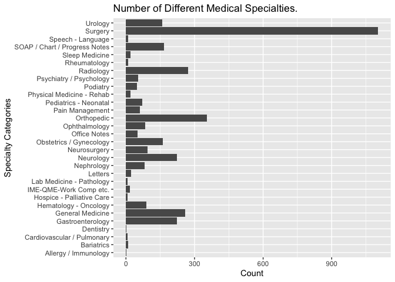
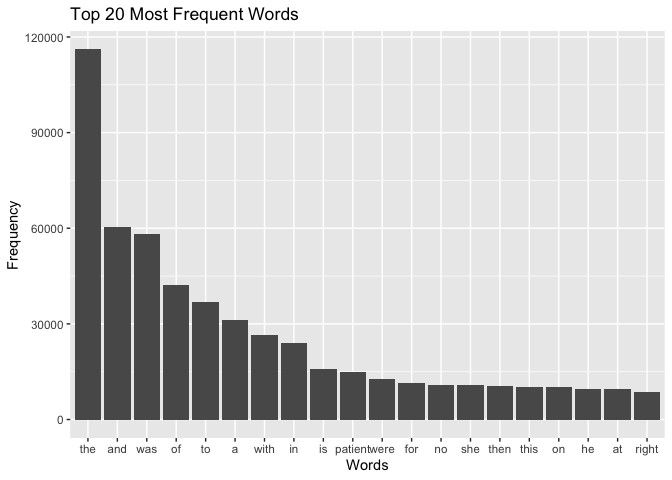
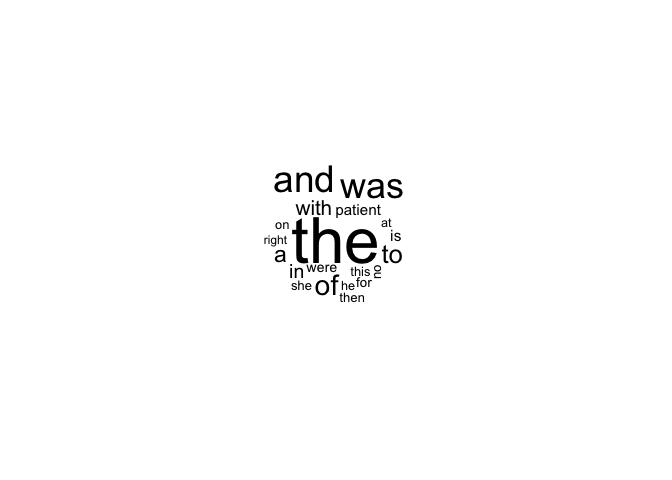
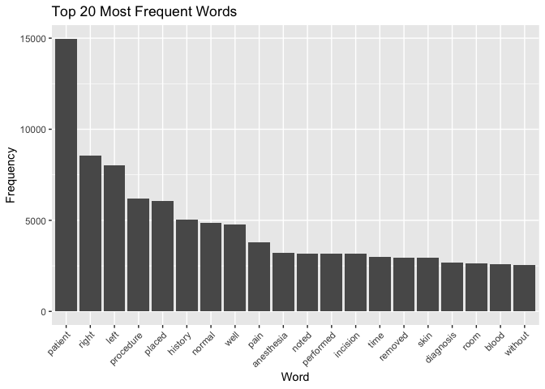
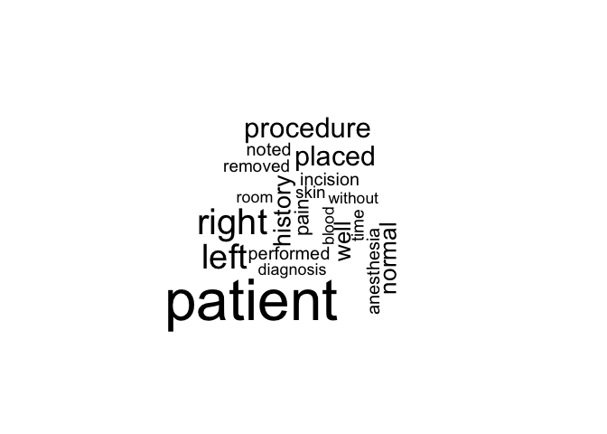
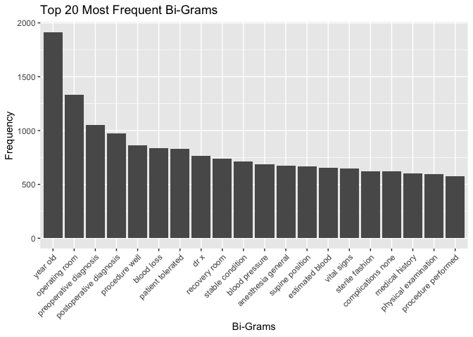
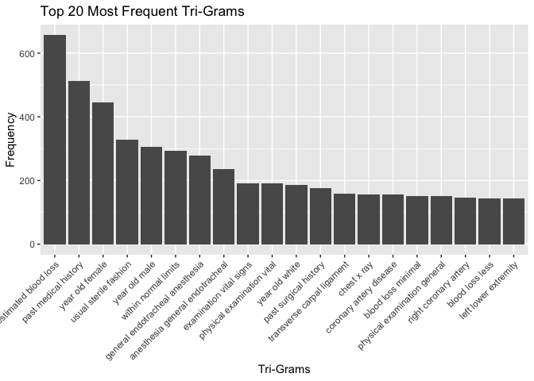
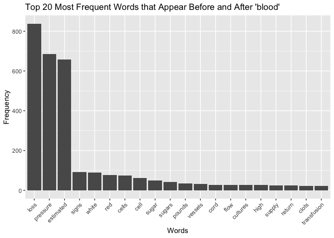
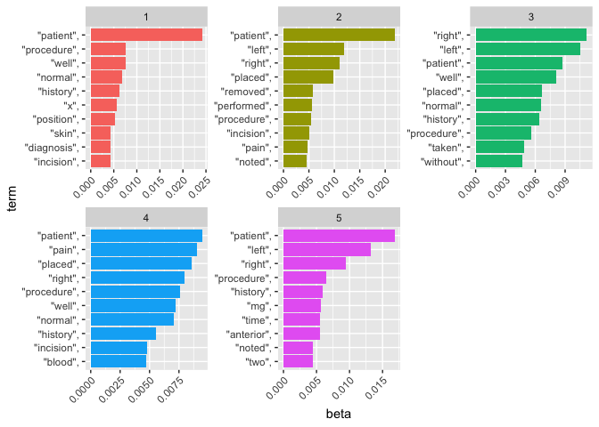

Lab 08 - Text Mining/NLP
================
Yufei Liu

# Learning goals

- Use `unnest_tokens()` and `unnest_ngrams()` to extract tokens and
  ngrams from text
- Use dplyr and ggplot2 to analyze and visualize text data
- Try a theme model using `topicmodels`

# Lab description

For this lab we will be working with the medical record transcriptions
from <https://www.mtsamples.com/>. And is loaded and “fairly” cleaned at
<https://github.com/JSC370/JSC370-2024/tree/main/data/medical_transcriptions>.

This markdown document should be rendered using `github_document`
document.

### Setup packages

You should load in `dplyr`, (or `data.table` if you want to work that
way), `ggplot2` and `tidytext`. Install `wordcloud`, `tm`, and
`topicmodels` if you don’t alreadyh have them.

### Read in the Medical Transcriptions

Loading in reference transcription samples from
<https://www.mtsamples.com/>

``` r
library(tidytext)
library(tidyverse)
```

    ## ── Attaching core tidyverse packages ──────────────────────── tidyverse 2.0.0 ──
    ## ✔ dplyr     1.1.4          ✔ readr     2.1.5     
    ## ✔ forcats   1.0.0          ✔ stringr   1.5.1     
    ## ✔ ggplot2   3.4.4.9000     ✔ tibble    3.2.1     
    ## ✔ lubridate 1.9.3          ✔ tidyr     1.3.1.9000
    ## ✔ purrr     1.0.2          
    ## ── Conflicts ────────────────────────────────────────── tidyverse_conflicts() ──
    ## ✖ dplyr::filter() masks stats::filter()
    ## ✖ dplyr::lag()    masks stats::lag()
    ## ℹ Use the conflicted package (<http://conflicted.r-lib.org/>) to force all conflicts to become errors

``` r
library(wordcloud)
```

    ## Loading required package: RColorBrewer

``` r
library(tm)
```

    ## Loading required package: NLP
    ## 
    ## Attaching package: 'NLP'
    ## 
    ## The following object is masked from 'package:ggplot2':
    ## 
    ##     annotate

``` r
library(topicmodels)

mt_samples <- read_csv("https://raw.githubusercontent.com/JSC370/JSC370-2024/main/data/medical_transcriptions/mtsamples.csv")
```

    ## New names:
    ## Rows: 3682 Columns: 6
    ## ── Column specification
    ## ──────────────────────────────────────────────────────── Delimiter: "," chr
    ## (5): description, medical_specialty, sample_name, transcription, keywords dbl
    ## (1): ...1
    ## ℹ Use `spec()` to retrieve the full column specification for this data. ℹ
    ## Specify the column types or set `show_col_types = FALSE` to quiet this message.
    ## • `` -> `...1`

``` r
mt_samples <- mt_samples %>%
  select(description, medical_specialty, transcription)

head(mt_samples)
```

    ## # A tibble: 6 × 3
    ##   description                                    medical_specialty transcription
    ##   <chr>                                          <chr>             <chr>        
    ## 1 A 23-year-old white female presents with comp… Allergy / Immuno… "SUBJECTIVE:…
    ## 2 Consult for laparoscopic gastric bypass.       Bariatrics        "PAST MEDICA…
    ## 3 Consult for laparoscopic gastric bypass.       Bariatrics        "HISTORY OF …
    ## 4 2-D M-Mode. Doppler.                           Cardiovascular /… "2-D M-MODE:…
    ## 5 2-D Echocardiogram                             Cardiovascular /… "1.  The lef…
    ## 6 Morbid obesity.  Laparoscopic antecolic anteg… Bariatrics        "PREOPERATIV…

------------------------------------------------------------------------

## Question 1: What specialties do we have?

We can use `count()` from `dplyr` to figure out how many different
medical specialties are in the data. Are these categories related?
overlapping? evenly distributed? Make a bar plot.

``` r
mt_samples |>
  count(medical_specialty, sort = TRUE) |>
  ggplot(aes(x = medical_specialty, y = n)) +
  geom_col() +
  labs(title = "Number of Different Medical Specialties.",
       x = "Specialty Categories",
       y = "Count") +
  coord_flip()
```

<!-- -->

- The categories are related since they are all medical specialties.
  More specifically, there are many specialties about medicine such as
  sleep medicine, general medicine, and lab medicine. There are some
  overlapping between the categories. For example, Surgery may include
  Neurosurgery. The categories are not evenly distributed. Some of them
  have extremmely high counts such as surgery, while some of them have
  low to 0 counts such as Dentistry and Allergy.

------------------------------------------------------------------------

## Question 2: Tokenize

- Tokenize the the words in the `transcription` column
- Count the number of times each token appears
- Visualize the top 20 most frequent words with a bar plot
- Create a word cloud

Explain what we see from this result. Does it makes sense? What insights
(if any) do we get?

``` r
# Tokenize the the words in the `transcription` column and count
tokens <- mt_samples |>
  select(transcription) |>
  unnest_tokens(word, transcription) |>
  group_by(word) |>
  summarise(word_frequency=n()) |>
  arrange(across(word_frequency, desc)) |>
  head(20)

# Visualize the top 20 most frequent words with a bar plot
tokens |>
  ggplot(aes(reorder(word, -word_frequency), word_frequency)) +
  geom_bar(stat='identity') +
  labs(title = "Top 20 Most Frequent Words",
       x = "Words",
       y = "Frequency")
```

<!-- -->

``` r
# Create a word cloud
wordcloud(tokens$word, tokens$word_frequency)
```

<!-- -->

- From the plot and word cloud, we can see that the words with top 20
  frequencies are determiners, conjunctions, pronouns, and so on which
  have no specific meanings and offer no information but are used in a
  sentence to make it correct in grammar and easier to read. They are
  the stopwords in language processing.
- This makes sense since they are exactly the most frequent words that
  we use in real life and need to appear a lot of times in sentences.
  Especially, “the” is the most frequent word to be used in a sentence.
  This paragraph contains a lot “the”s as well.
- We get few insights about what the text is about.

------------------------------------------------------------------------

## Question 3: Stopwords

- Redo Question 2 but remove stopwords(use stopwords package)
- Bonus points if you remove numbers as well (use regex)

What do we see know that we have removed stop words? Does it give us a
better idea of what the text is about?

- Try customizing your stopwords list to include 3-4 additional words
  that do not appear informative

``` r
head(stopwords("english"))
```

    ## [1] "i"      "me"     "my"     "myself" "we"     "our"

``` r
length(stopwords("english"))
```

    ## [1] 174

``` r
stopwords_customized <- c(stopwords("english"), "using", "used", "also", "will")

tokens <- mt_samples |>
  select(transcription) |>
  unnest_tokens(word, transcription) |>
  # Remove stopwords
  filter(!(word %in% stopwords_customized)) |>
  # Remove numbers
  filter(!(grepl("[[:digit:]]+", word))) |>
  # Count the number of times each token appears
  group_by(word) |>
  summarise(word_frequency=n()) |>
  arrange(across(word_frequency, desc)) |>
  head(20)

# Visualize the top 20 most frequent words with a bar plot
tokens |>
  ggplot(aes(reorder(word, -word_frequency), word_frequency)) +
  geom_bar(stat='identity') +
  labs(title = "Top 20 Most Frequent Words",
       x = "Word",
       y = "Frequency") +
  theme(axis.text.x = element_text(angle = 45, hjust = 1))
```

<!-- -->

``` r
# Create a word cloud
wordcloud(tokens$word, tokens$word_frequency)
```

<!-- -->

- We can see that the top 20 words in the barplot are different than the
  previous barplot with the stopwords being removed. The stopwords in
  the previous word cloud are removed and no longer appear in the new
  word cloud.
- This gives us a better idea of what the text is about. From the words
  “patient”, “pain”, “diagnosis”, we may infer that the text is about
  medical areas.

------------------------------------------------------------------------

# Question 4: ngrams

Repeat question 2, but this time tokenize into bi-grams. How does the
result change if you look at tri-grams? Note we need to remove stopwords
a little differently. You don’t need to recreate the wordclouds.

``` r
# bi-grams
sw_start <- paste0("^", paste(stopwords_customized, collapse=" |^"), "$")
sw_end <- paste0("", paste(stopwords_customized, collapse="$| "), "$")

tokens_bigram <- mt_samples |>
  select(transcription) |>
  # Tokenize into bi-grams
  unnest_tokens(ngram, transcription, token = "ngrams", n = 2) |>
  # Remove stopwords
  filter(!(grepl(sw_start, ngram, ignore.case = TRUE))) |>
  filter(!(grepl(sw_end, ngram, ignore.case = TRUE))) |>
  # Remove numbers
  filter(!(grepl("[[:digit:]]+", ngram)))
  
# Count the number of times each token appears
tokens_bigram_freq <- tokens_bigram |>
  group_by(ngram) |>
  summarize(word_frequency = n()) |>
  arrange(across(word_frequency, desc)) |>
  head(20)

# Visualize the top 20 most frequent bi-grams with a bar plot
tokens_bigram_freq |>
  ggplot(aes(reorder(ngram, -word_frequency), word_frequency)) +
  geom_bar(stat='identity') +
  labs(title = "Top 20 Most Frequent Bi-Grams",
       x = "Bi-Grams",
       y = "Frequency") +
  theme(axis.text.x = element_text(angle = 45, hjust = 1))
```

<!-- -->

``` r
# tri-grams
sw_mid <- paste0("", paste(stopwords_customized, collapse=" | "), "$")

tokens_trigram <- mt_samples |>
  select(transcription) |>
  # Tokenize into tri-grams
  unnest_tokens(ngram, transcription, token = "ngrams", n = 3) |>
  # Remove stopwords
  filter(!(grepl(sw_start, ngram, ignore.case = TRUE))) |>
  filter(!(grepl(sw_mid, ngram, ignore.case = TRUE))) |>
  filter(!(grepl(sw_end, ngram, ignore.case = TRUE))) |>
  # Remove numbers
  filter(!(grepl("[[:digit:]]+", ngram)))|>
  # Count the number of times each token appears
  group_by(ngram) |>
  summarize(word_frequency = n()) |>
  arrange(across(word_frequency, desc)) |>
  head(20)

# Visualize the top 20 most frequent tri-grams with a bar plot
tokens_trigram |>
  ggplot(aes(reorder(ngram, -word_frequency), word_frequency)) +
  geom_bar(stat='identity') +
  labs(title = "Top 20 Most Frequent Tri-Grams",
       x = "Tri-Grams",
       y = "Frequency") +
  theme(axis.text.x = element_text(angle = 45, hjust = 1))
```

<!-- -->

- From the 2 plots, we can see that many tri-grams with top 20 frequency
  are extended from a bi-gram with top 20 frequency. For example, “year
  old” is extended to “year old female”, “year old male”, “year old
  white”, where tri-grams provides more information and context of the
  text.

------------------------------------------------------------------------

# Question 5: Examining words

Using the results from the bigram, pick a word and count the words that
appear before and after it, and create a plot of the top 20.

``` r
library(stringr)
# e.g. patient, blood, preoperative...
tokens_bigram_blood <- tokens_bigram |>
  # Pick the word blood
  filter(str_detect(ngram, regex("\\sblood$|^blood\\s"))) |>
  mutate(word = str_remove(ngram, "blood"),
         word = str_remove_all(word, " ")) |>
  # Count the words that appear before and after it
  group_by(word) |>
  summarise(word_frequency=n()) |>
  arrange(across(word_frequency, desc))

# Create a plot of the top 20
tokens_bigram_blood |>
  head(20) |>
  ggplot(aes(reorder(word, -word_frequency), word_frequency)) +
  geom_bar(stat='identity') +
  labs(title = "Top 20 Most Frequent Words that Appear Before and After 'blood'",
       x = "Words",
       y = "Frequency") +
  theme(axis.text.x = element_text(angle = 45, hjust = 1))
```

<!-- -->

------------------------------------------------------------------------

# Question 6: Words by Specialties

Which words are most used in each of the specialties. you can use
`group_by()` and `top_n()` from `dplyr` to have the calculations be done
within each specialty. Remember to remove stopwords. How about the most
5 used words?

``` r
# Find the frequencies of words used in each of the specialties
mt_spec_count <- mt_samples |>
  unnest_tokens(word, transcription) |>
  filter(!(word %in% stopwords_customized)) |>
  filter(!(grepl("[[:digit:]]+", word))) |>
  group_by(medical_specialty) |>
  count(word) |>
  arrange(medical_specialty, desc(n))

# Find the most used words in each of the specialties
mt_spec_count |> 
  top_n(1, n)
```

    ## # A tibble: 31 × 3
    ## # Groups:   medical_specialty [30]
    ##    medical_specialty          word          n
    ##    <chr>                      <chr>     <int>
    ##  1 Allergy / Immunology       allergies     4
    ##  2 Bariatrics                 patient      29
    ##  3 Cardiovascular / Pulmonary normal       25
    ##  4 Dentistry                  removed      10
    ##  5 Gastroenterology           patient     835
    ##  6 General Medicine           patient    1356
    ##  7 Hematology - Oncology      patient     316
    ##  8 Hospice - Palliative Care  patient      43
    ##  9 IME-QME-Work Comp etc.     pain        152
    ## 10 Lab Medicine - Pathology   cm           35
    ## # ℹ 21 more rows

``` r
# Find the most 5 used words in each of the specialties
mt_spec_count |> 
  top_n(5, n)
```

    ## # A tibble: 170 × 3
    ## # Groups:   medical_specialty [30]
    ##    medical_specialty    word             n
    ##    <chr>                <chr>        <int>
    ##  1 Allergy / Immunology allergies        4
    ##  2 Allergy / Immunology allegra          3
    ##  3 Allergy / Immunology clear            3
    ##  4 Allergy / Immunology prescription     3
    ##  5 Allergy / Immunology sprays           3
    ##  6 Bariatrics           patient         29
    ##  7 Bariatrics           history         21
    ##  8 Bariatrics           placed          21
    ##  9 Bariatrics           abdomen         20
    ## 10 Bariatrics           procedure       18
    ## # ℹ 160 more rows

# Question 7: Topic Models

See if there are any themes in the data by using a topic model (LDA).

- you first need to create a document term matrix
- then you can try the LDA function in `topicmodels`. Try different k
  values.
- create a facet plot of the results from the LDA (see code from
  lecture)

``` r
# Create a document term matrix
transcripts_dtm <- mt_samples |>
  select(transcription) |>
  unnest_tokens(word, transcription) |>
  filter(!(word %in% stopwords_customized)) |>
  filter(!(grepl("[[:digit:]]+", word))) |>
  DocumentTermMatrix()

transcripts_dtm <- as.matrix(transcripts_dtm)   

# Try the LDA function with different k values
transcripts_lda <- LDA(transcripts_dtm, k = 5, control = list(seed = 6003))
transcripts_lda
```

    ## A LDA_VEM topic model with 5 topics.

``` r
# Create a facet plot of the results from the LDA
transcripts_top_terms <- 
  tidy(transcripts_lda, matrix = "beta") |>
  group_by(topic) |>
  slice_max(beta, n = 10) |> 
  ungroup() |>
  arrange(topic, -beta)

transcripts_top_terms |>
  mutate(term = reorder_within(term, beta, topic)) %>%
  ggplot(aes(beta, term, fill = factor(topic))) +
  geom_col(show.legend = FALSE) +
  facet_wrap(~ topic, scales = "free") +
  scale_y_reordered() +
  theme(axis.text.x = element_text(angle = 45, hjust = 1))
```

<!-- -->

# Deliverables

1.  Questions 1-7 answered, raw .Rmd file and pdf or html output
    uploaded to Quercus
